# Final Interview

## Problem

**Amazon Top K Frequent Elements**


## Top K Frequent Elements

Given an integer array `nums`, return the **`k`** most frequent elements.  
You may assume that the answer is **unique**, meaning there will be no ties in frequency that affect the result — the `k` most frequent elements are clearly defined.    
Your algorithm's time complexity must be **better than O(n log n)**, where `n` is the array's length.


## Example


```python
Input: nums = [1,1,1,2,2,3,3,3,4,4,4,4], k = 3  
Output: [4, 1, 3]
```

Explanation:  
- `4` appears 4 times  
- `1` and `3` appear 3 times  
- `2` appears only 2 times  
So the top 3 frequent elements are `4`, `1`, and `3`.


## Constraints

- `1 <= nums.length <= 10⁵`  
- `-10⁴ <= nums[i] <= 10⁴`  
- `1 <= k <= number of unique elements in the array` 
- The result will always have **one valid answer** — no ambiguity due to ties in frequency.

## Assignment

Implement the solution in Python. Your function must use the following declaration:

```python
def topKFrequent(nums: list[int], k: int) -> list[int]
```

## Hints

<details>
<summary><strong>Hint 1</strong></summary>

What’s the first step? We need to know how many times each number appears in the array. Is there a data structure that can help us count occurrences quickly?
</details>

<details>
<summary><strong>Hint 2</strong></summary>

How do we find the top `k` elements? Once we have the frequencies, how do we efficiently find the top `k` elements? Can we avoid sorting the entire list?
</details>

<details>
<summary><strong>Hint 3</strong></summary>

Could a heap help?Heaps are great for retrieving top values efficiently. Could we use a min-heap of size `k` to track the most frequent elements as we go?
</details>

<details>
<summary><strong>Hint 4</strong></summary>

What if we wanted to do better? Could we group elements by frequency and then iterate from highest to lowest?
</details>

<details>
<summary><strong>Hint 5</strong></summary>

What’s the role of a frequency bound? This problem has a clear upper bound on frequency — no number appears more than `n` times. Could we use this to our advantage with something like **bucket sort**?
</details>


---

## Solutions


### Sorting

A natural first approach is to count how often each number appears, then sort those counts and take the top `k`.

1. **Count Frequencies:**  
   First, we count the number of times each element appears in the input list. This can be done efficiently using a dictionary, which gives us a mapping of each number to its frequency in `O(n)` time.

2. **Sort by Frequency:**  
   Once we have the frequencies, we sort the list of `(frequency, element)` pairs in descending order by frequency. This step takes `O(n log n)` time due to the sort.

3. **Select Top `k`:**  
   Finally, we extract the first `k` elements from the sorted list. These are the `k` most frequent elements.


**Example:**

Suppose `nums = [1,1,1,2,2,3]`, and `k = 2`.

- Frequencies: `{1: 3, 2: 2, 3: 1}`
- Sorted by frequency in descending order: `[(3, 1), (2, 2), (1, 3) ]`
- Top 2 elements: `[1, 2]`


While this method works and is easy to implement, it doesn't meet the problem's constraint of being faster than `O(n log n)`. For that, we need a more efficient solution.

### Min-Heap

The sorting approach is simple but doesn’t meet the problem’s requirement of being faster than `O(n log n)`. We can do better using a **heap**.

Instead of sorting the entire list of frequencies, we maintain a **min-heap of size `k`** to track the top `k` most frequent elements as we go.


1. **Count Frequencies:**  
   As before, we start by using a dictionary to count how many times each number appears. This takes `O(n)` time.

2. **Use a Min-Heap:**  
   We iterate through the frequency map and push each `(frequency, number)` pair into a heap.  
   - If the heap exceeds size `k`, we pop the smallest frequency element (i.e., the least useful).
   - This way, the heap always contains the top `k` frequent elements.

   Because the heap size stays fixed at `k`, each push/pop is `O(log k)`, and iterating through all elements is `O(n log k)` overall better than `O(n log n)` when `k << n`.

3. **Extract the Result:**  
   At the end, we extract the elements from the heap.


**Example:**

Suppose `nums = [1,1,1,2,2,3]` and `k = 2`.

- Frequencies: `{1: 3, 2: 2, 3: 1}`
- Push all pairs into a heap:
  - Push `(3, 1)` → heap = `[(3, 1)]`
  - Push `(2, 2)` → heap = `[(2, 2), (3, 1)]`
  - Push `(1, 3)` → heap = `[(2, 2), (3, 1), (1, 3)]` → heap exceeds size `k`, pop `(1, 3)` → heap = `[(2, 2), (3, 1)]`
- Top 2 elements: `[2, 1]`


This approach is efficient and satisfies the problem's time constraint of being faster than `O(n log n)` when `k` is small compared to `n`.

### Bucket Sort

To achieve truly linear time complexity — `O(n)` — we can avoid both sorting and heaps by using a **bucket sort**-style strategy.

This approach relies on the fact that the **maximum frequency** of any number is bounded by the length of the input array. In other words, no number can appear more than `n` times, so we can use an array of size `n + 1` to "bucket" numbers by how frequently they appear.


1. **Count Frequencies:**  
   As in previous approaches, we start by counting how many times each number appears using a dictionary. This step is `O(n)`.

2. **Bucket by Frequency:**  
   Next, we create a list of buckets `1 to n`, where the index of each bucket corresponds to a specific frequency.  
   For example, `buckets[3]` will hold a list of all elements that appear exactly 3 times.  
   We iterate through the frequency dictionary and place each element in its corresponding bucket.

3. **Collect Top `k`:**  
   Now we walk through the buckets **in reverse order** (from highest frequency to lowest), collecting elements until we have `k` of them.  


    **Example:**

    Suppose `nums = [1,1,1,2,2,3]` and `k = 2`.

    - Frequencies: `{1: 3, 2: 2, 3: 1}`
    - Buckets:  
    - `buckets[1] = [3]`  
    - `buckets[2] = [2]`  
    - `buckets[3] = [1]`
    - Reverse iterate:  
    - From `buckets[3]`, take `1`  
    - From `buckets[2]`, take `2`  
    - Top 2 elements: `[1, 2]`


This method is the most efficient and elegant requiring a linear time performance.


## Complexity

| Approach     | Time Complexity     | Space Complexity | Meets O(n log n) Constraint? | Notes                                      |
|--------------|---------------------|------------------|------------------------------|--------------------------------------------|
| Sorting      | O(n log n)          | O(n)             | ❌ No                        | Simple to implement but too slow for large `n` |
| Min-Heap     | O(n log k)          | O(n)             | ✅ Yes                       | Efficient when `k` is much smaller than `n` |
| Bucket Sort  | O(n)                | O(n)             | ✅ Yes                       | Fastest solution; ideal for large inputs    |


Each method is correct, but only **Min-Heap** and **Bucket Sort** satisfy the performance constraint. Among them, **Bucket Sort** is the only truly linear-time approach.

---

## Solution visualization

## Solution Visualization

<details>
<summary><strong>Slide 1</strong></summary>
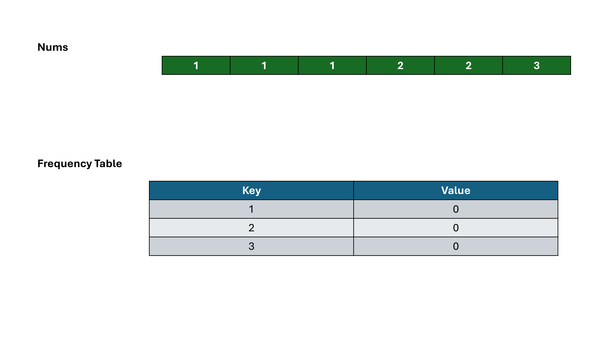
</details>

<details>
<summary><strong>Slide 2</strong></summary>
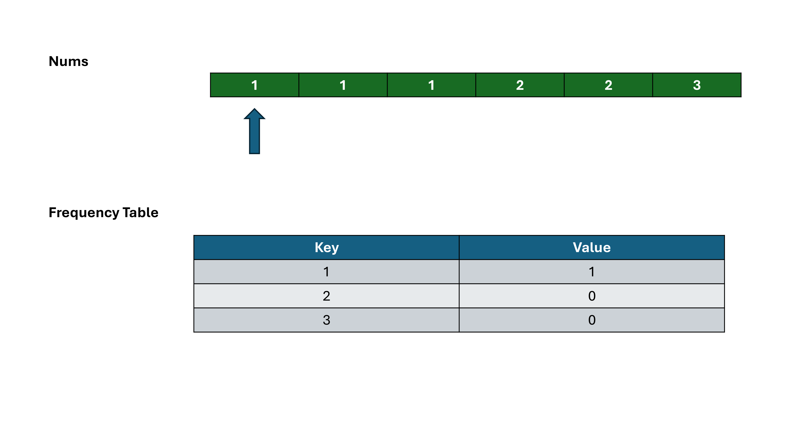
</details>

<details>
<summary><strong>Slide 3</strong></summary>
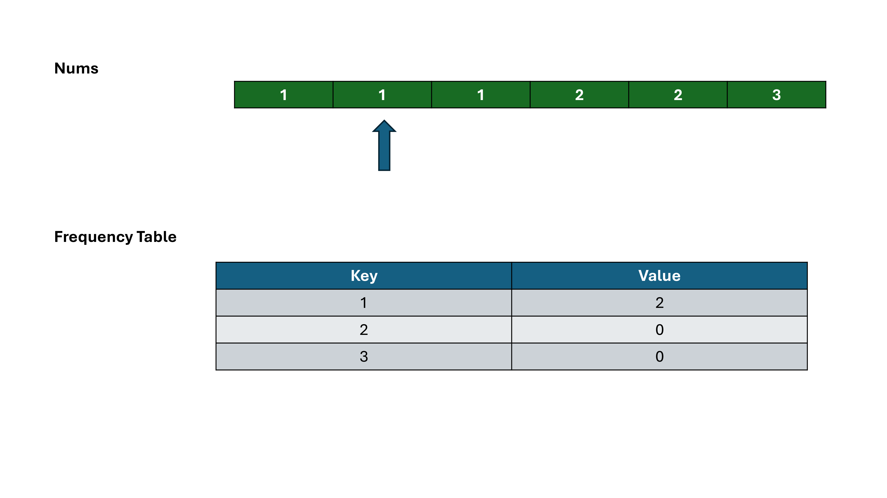
</details>

<details>
<summary><strong>Slide 4</strong></summary>
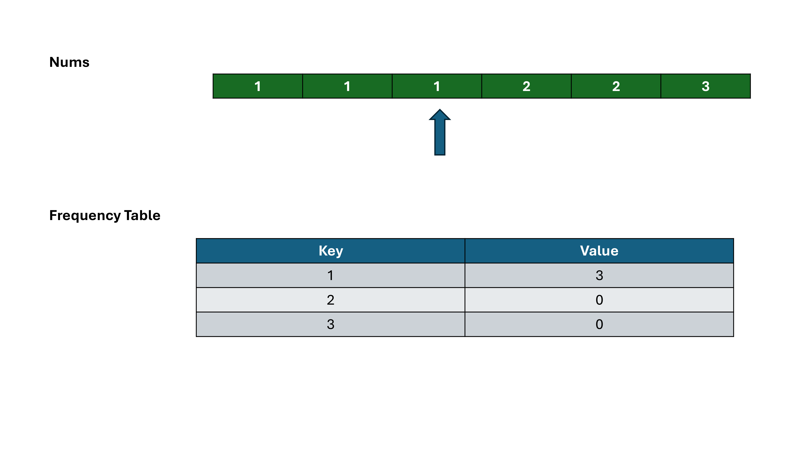
</details>

<details>
<summary><strong>Slide 5</strong></summary>
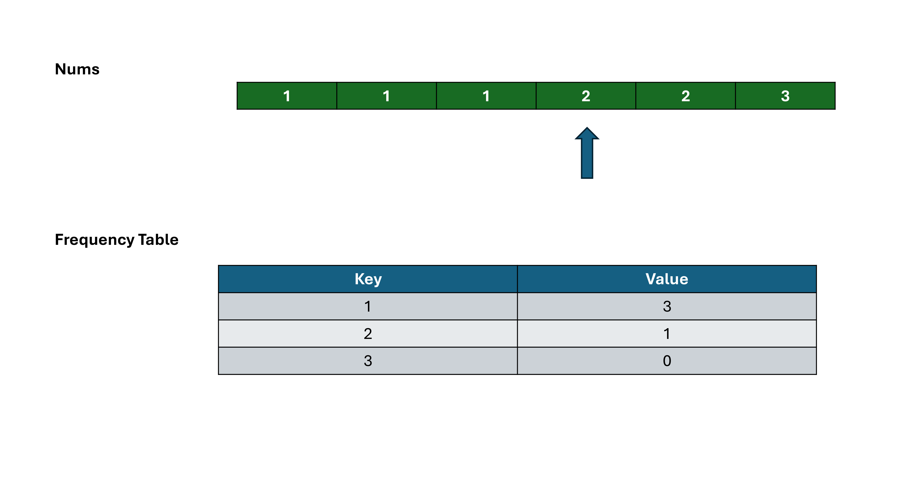
</details>

<details>
<summary><strong>Slide 6</strong></summary>
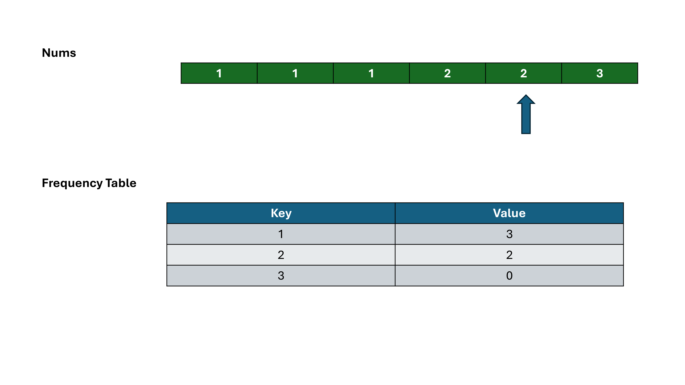
</details>

<details>
<summary><strong>Slide 7</strong></summary>
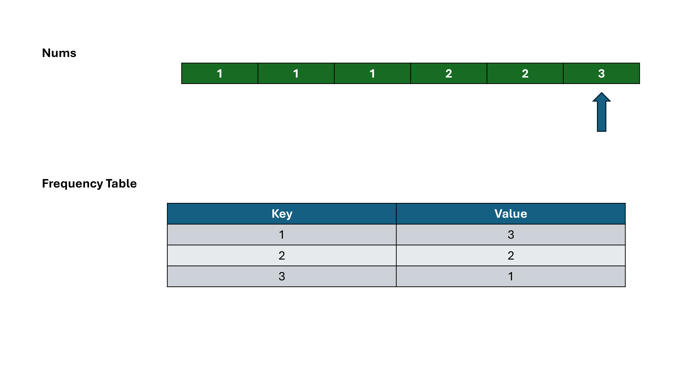
</details>

<details>
<summary><strong>Slide 8</strong></summary>
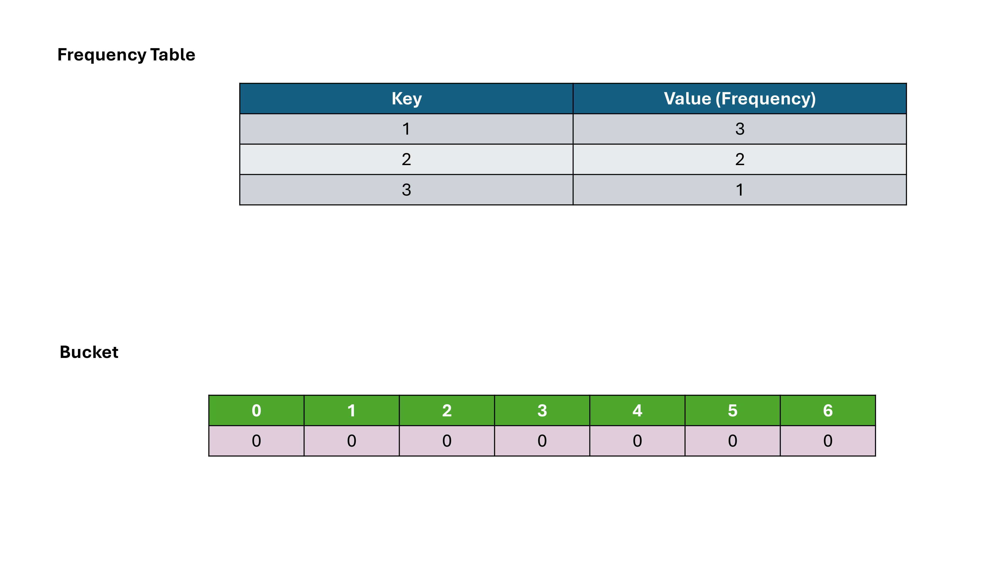
</details>

<details>
<summary><strong>Slide 9</strong></summary>
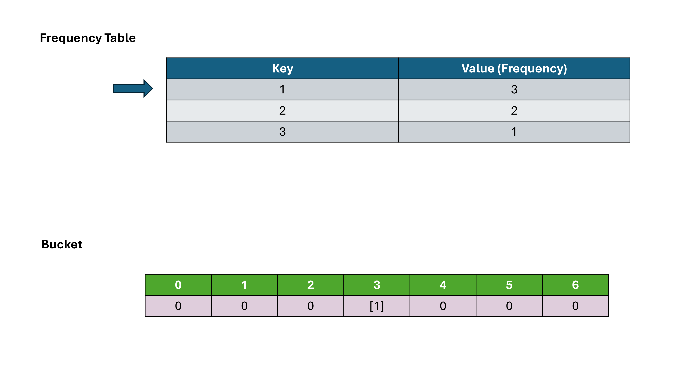
</details>

<details>
<summary><strong>Slide 10</strong></summary>
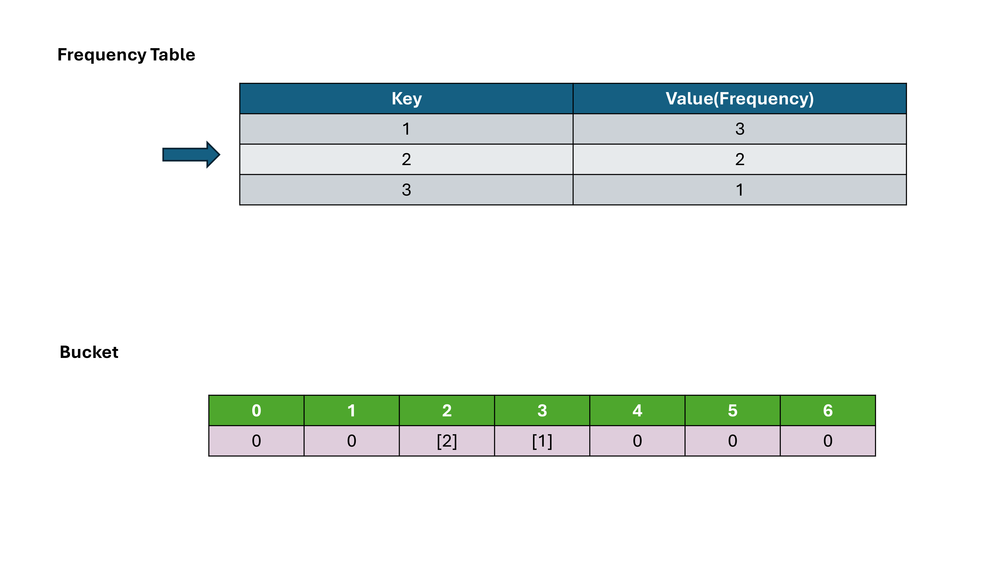
</details>

<details>
<summary><strong>Slide 11</strong></summary>
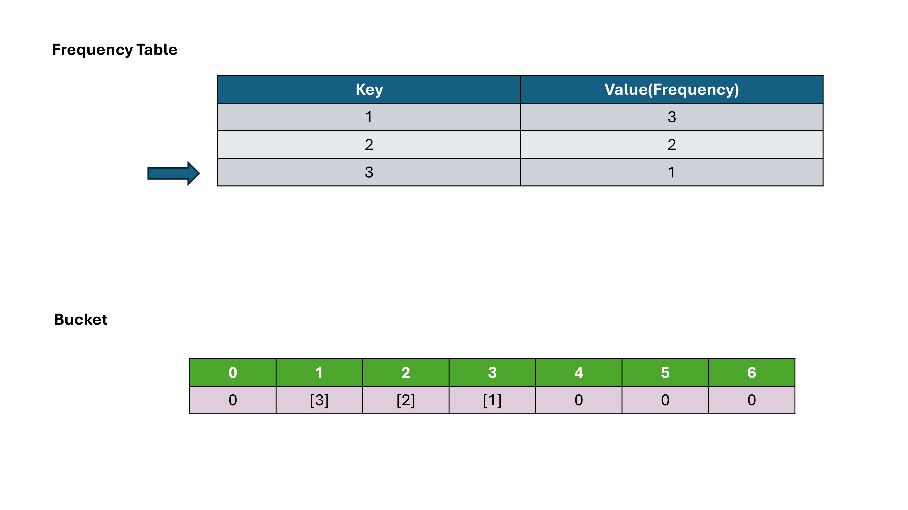
</details>

<details>
<summary><strong>Slide 12</strong></summary>
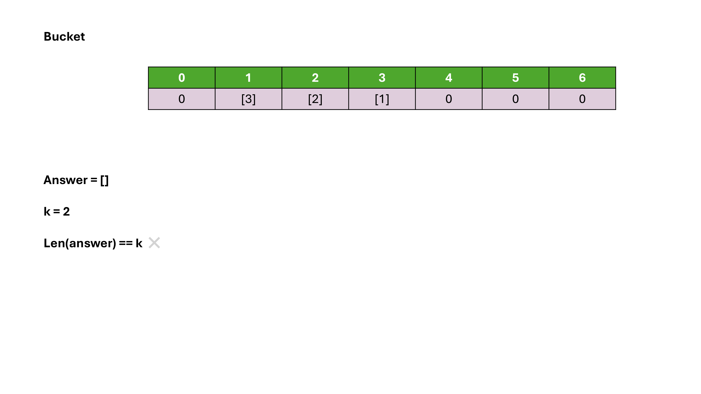
</details>

<details>
<summary><strong>Slide 13</strong></summary>
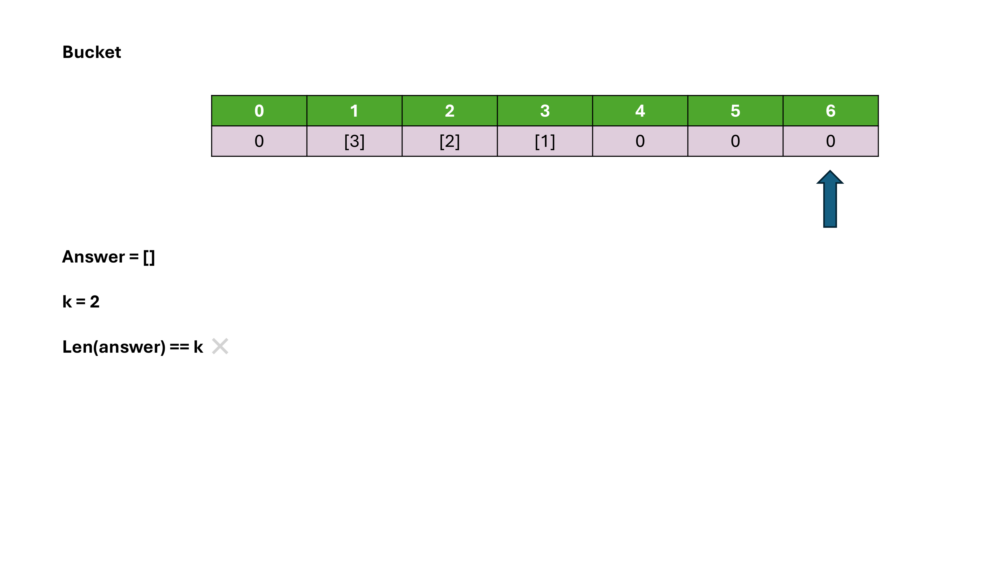
</details>

<details>
<summary><strong>Slide 14</strong></summary>
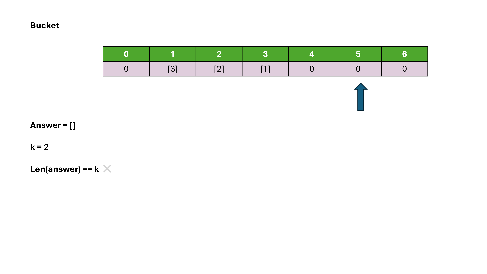
</details>

<details>
<summary><strong>Slide 15</strong></summary>

</details>

<details>
<summary><strong>Slide 16</strong></summary>
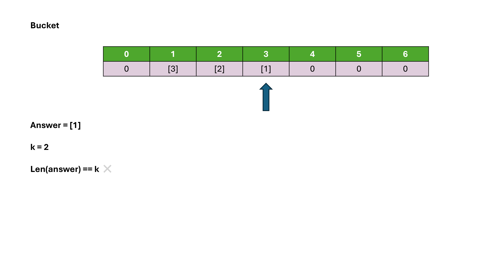
</details>

<details>
<summary><strong>Slide 17</strong></summary>
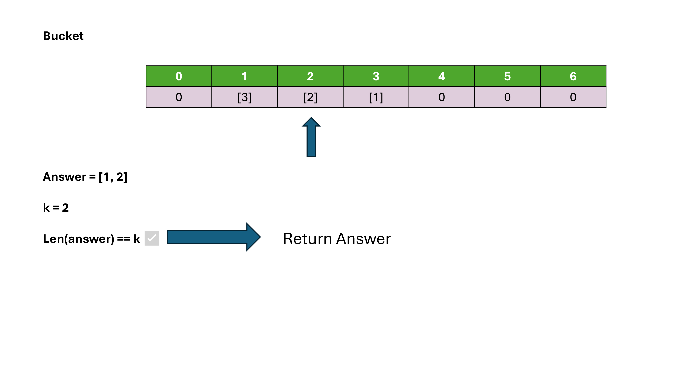
</details>


## References

- [Top K Frequent Elements – NeetCode](https://neetcode.io/problems/top-k-elements-in-list)
- [Top K Frequent Elements - LeetCode ](https://leetcode.com/problems/top-k-frequent-elements/description/)
